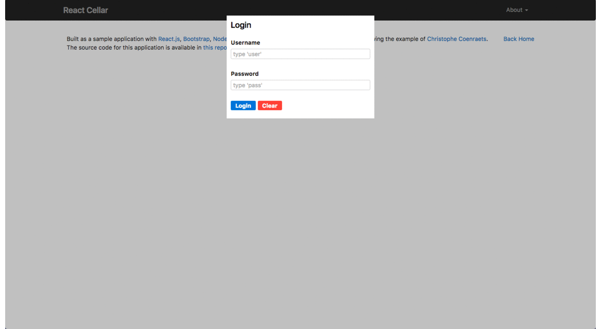

# Demo

[](https://greenkeeper.io/)
https://react-cellar.herokuapp.com/

# Intro 
http://ayxos.com/wine-cellar-backbone-angular-react-a-tribute-to-christophe-coenraets/

# React Cellar

I replicated Christophe Coenraets' Wine-cellar example with React to help whoever is interested in learning how this new technology works, giving the user the chance to compare between different environments.



# Based on
Based on "typescript-react-redux-starter"
and Redux-form (https://github.com/erikras/redux-form)

# Technologies
- Typescript
- React
- Redux
- D&D
- Webpack

## npm scripts

### Dev
```bash
$ npm run dev
```

This runs a development mode server with live reload etc.

Open `http://localhost:8080` in your browser.

### Production

```bash
npm install
npm start
```

This runs a production-ready express server that serves up a bundled and
minified version of the client.

Open `http://localhost:8080` in your browser.

> Note: Demo username/password can be found [here](https://github.com/ayxos/react-cellar/blob/master/server/users.json)

### Tests

#### Single Run
```bash
$ npm run test
```

#### Watch Files
```bash
$ npm run test:watch
```

#### Coverage
```bash
$ npm run cover
```
## Contributing

Please feel free to submit Pull Requests or open issues to improve, share your ideas/thoughts, or discuss any part of this manifesto.


## License

[MIT License][MIT]

[MIT]: ./LICENSE "Mit License"
